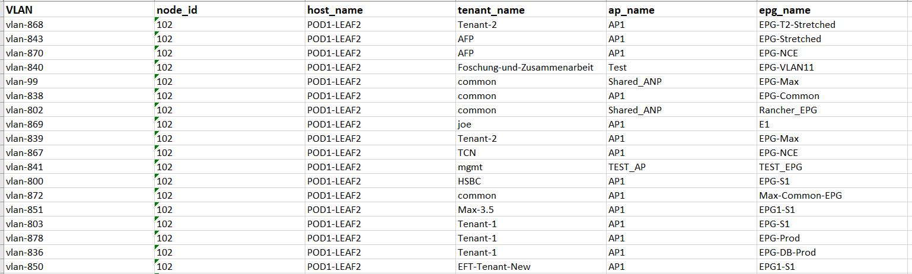

# Get Contract Relationships


This tool collects the Contracts deployed in the ACI fabric and shows how their are used in an excel files.

## Getting Started

### Prerequisites

* Python 3 (create your venv)

```
 python3 -m venv venv
```
* Activate your venv

```
 source venv/bin/activate
```

### Installing
1. Run pip command to install required libraries.

```
> pip install -r requirements.txt
```

## Usage

Insert the login data in the file `Utils/credentials.json`:

Example:
```
{
"apic_ip_address": "X.X.X.X",
"apic_port": "443",
"apic_admin_user": "admin",
"apic_admin_password": "xxxxxxxx"
}
```

then run the script using a *python3* interpreter:

```
$python3 main.py
```

it will create the xlsx file `Contract_Relationship.xlsx` that contains a global sheet with the summary report and details sheet for each resource that lists all of them:





## Authors

* **Gaetano Carlucci** 
